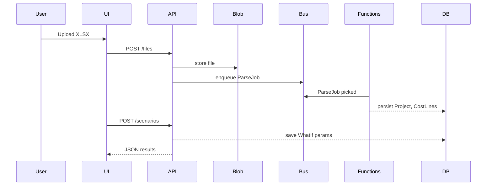

# What-If Calculator — Technical Specification

## 1. Overview

Internal progressive-web application (PWA) that lets managers, estimators and project managers run "what-if" scenarios against historical job-cost data stored in Excel workbooks.

* **Users:** ≤ 20 registered, ≤ 5 concurrent
* **Hosting:** Microsoft Azure (App Service + Functions + Storage + PostgreSQL)
* **Security:** Email / password with Azure AD B2C, JWT access tokens, role-based ACL (viewer, editor, admin)
* **Offline:** Workbox service-worker, IndexedDB caching & background-sync
* **Alerts:** Email (SendGrid) + SMS (Twilio) on red-flag thresholds
* **Exports:** PDF (Puppeteer) & XLSX (SheetJS)

## 2. High-Level Architecture

| Layer           | Tech / Service                                    | Notes                                                        |
| --------------- | ------------------------------------------------- | ------------------------------------------------------------ |
| Front-end       | **React 18** + Vite + TypeScript                  | Responsive UI, PWA, TailwindCSS                              |
| State           | **Redux Toolkit** + RTK Query                     | Normalised scenario data                                     |
| Auth            | Azure AD B2C                                      | Hosted login, email + password, password reset, MFA optional |
| API             | **NestJS 10** (Node 20)                           | REST + WebSocket                                             |
| DB              | **Azure Database for PostgreSQL Flexible Server** | JSONB for dynamic column maps                                |
| File storage    | **Azure Blob Storage**                            | Versioned uploads                                            |
| Background jobs | **Azure Functions** (Node)                        | XLSX parsing, threshold checks                               |
| Queue           | **Azure Service Bus**                             | Decouple heavy jobs                                          |
| Alerts          | SendGrid & Twilio                                 | Email & SMS                                                  |
| Monitoring      | Azure Application Insights                        | Logs, traces, dashboards                                     |
| CI/CD           | GitHub Actions → Azure App Service & Functions    | Blue-green slots, PR previews                                |

### Sequence (Upload & What-If)



## 3. Data Model (TypeScript)

```ts
export interface User {
  id: UUID
  email: string
  role: 'viewer' | 'editor' | 'admin'
  createdAt: Date
}

export interface Project {
  id: UUID
  name: string
  sizeUnits?: number
  sizeSqFt?: number
  sizeDollars?: number
  scope: 'plumbing' | 'hvac' | 'combined'
  durationWeeks: number
  costs: CostBreakdown
  crewSize: number
  revenuePerTechDay: number
  grossProfit: number
  netProfit: number
  cashFlow?: CashPoint[]
  columnMap: Record<string, string> // uploaded mapping
}

export interface Scenario {
  id: UUID
  projectId: UUID | null   // null = green-field
  ownerId: UUID
  isPublic: boolean
  inputs: ScenarioInput
  outputs: ScenarioOutput
  createdAt: Date
  updatedAt: Date
}

export interface ScenarioInput {
  projectSize: { units?: number; dollars?: number; sqFt?: number }
  scope: ('plumbing' | 'hvac' | 'combined')[]
  crewChange: number
  scheduleChangeWeeks: number
  overheadChangePct?: number
  materialInflationPct?: number
  laborRateChangePct?: number
  targetProfitPct?: number
}

export interface ScenarioOutput {
  totalRevenue: number
  totalCost: number
  grossMarginPct: number
  laborHours: number
  laborPerUnit: number
  profitDollars: number
  profitPct: number
  cashFlowForecast: CashPoint[]
  alerts: Alert[]
}

export interface Alert {
  message: string
  severity: 'info' | 'warning' | 'critical'
}

export interface CashPoint { week: number; cash: number }
```

## 4. API (OpenAPI 3.1 excerpt)

| Method | Path                          | Desc                              |
| ------ | ----------------------------- | --------------------------------- |
| `POST` | `/auth/register`              | email + password                  |
| `POST` | `/auth/login`                 | returns JWT                       |
| `GET`  | `/projects`                   | list uploaded projects            |
| `POST` | `/projects`                   | upload XLSX (multipart/form-data) |
| `POST` | `/projects/{id}/column-map`   | save column mapping               |
| `GET`  | `/scenarios`                  | list visible scenarios            |
| `POST` | `/scenarios`                  | create & compute                  |
| `PUT`  | `/scenarios/{id}`             | edit inputs                       |
| `POST` | `/scenarios/{id}/export/pdf`  | generate PDF                      |
| `POST` | `/scenarios/{id}/export/xlsx` | generate XLSX                     |

Error envelope:

```json
{
  "error": "VALIDATION_ERROR",
  "message": "laborRateChangePct must be between 0 and 100",
  "details": {...}
}
```

## 5. Security

* **Transport:** HTTPS everywhere (Azure Front Door)
* **Auth:** Azure AD B2C → JWT (`alg=RS256`), 60 min expiry, refresh on 55 min
* **RBAC:** `viewer`, `editor`, `admin` enforced via Nest Guards
* **Storage:** Blob container with private access, SAS tokens per download
* **Secrets:** `.env` injected via Azure Key Vault
* **XLSX Sanitisation:** Use `xlsx` library, reject macros, strip formulas

## 6. Performance & Benchmarks

* < 2 s median TTFB for `/scenarios` (API + DB)
* XLSX parse jobs complete < 5 s for files ≤ 10 MB (99th percentile)
* PWA bundle ≤ 250 KB gzip; LCP < 2.5 s on slow 4G

## 7. Monitoring & Logging

| Signal          | Tool          | Threshold             |
| --------------- | ------------- | --------------------- |
| API latency     | App Insights  | warn > 800 ms         |
| Function errors | App Insights  | alert any             |
| DB CPU > 70 %   | Azure Monitor | SMS                   |
| Twilio failures | Functions log | email summary nightly |

## 8. Error Handling Strategy

* Central NestJS `AllExceptionsFilter` → JSON envelope
* Retry XLSX parse (up to 3) via Service Bus DLQ
* User-friendly toast in UI + optional Sentry capture

## 9. Scalability Roadmap

1. Scale-out App Service plan to 2× B1 when > 10 concurrent
2. Convert Functions to Durable Functions for large batch imports (> 100 files)
3. Add Redis cache for heavy scenario re-runs
4. Split read replicas if DB CPU > 70 %